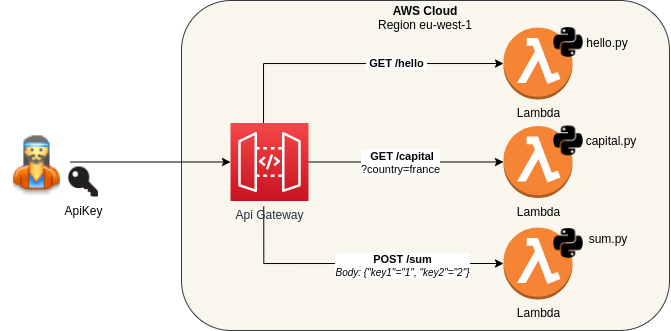
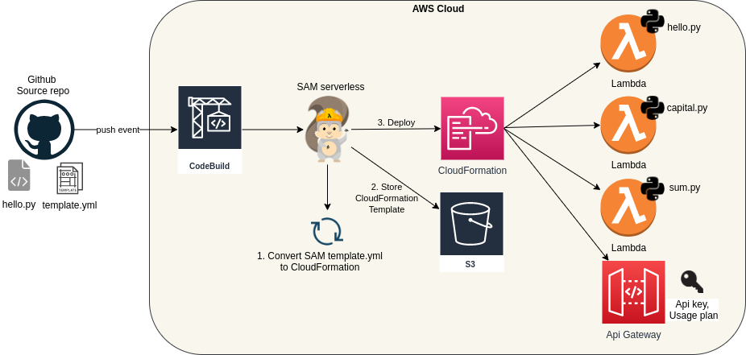

# MyApp: Lamda + API Gateway deployed with AWS SAM Serverless

## Overview
This setup will deploy a 3 Python Lambda functions, and connect them to API Gateway.
The workflow is using SAM serverless framework to simplify CI/CD.

More info: you can find an overview of that setup on my [blog](https://greg.satoshi.tech/sam-serverless)


### Infra

- Cloud: AWS
- API: [API Gateway](https://aws.amazon.com/api-gateway) from AWS, to unify and control user requests
- App: 3 simple [Lambda](https://aws.amazon.com/lambda/) functions in Python
- Code source: Github
- CI: Codebuild
- Deployment: [CloudFormation](https://aws.amazon.com/cloudformation) templates
- [SAM serverless](https://aws.amazon.com/serverless/sam): AWS framework making easier the deployment (CD) of Lambda and API Gateway
- S3: to store Cloudformation template during deployment


### CI/CD flow diagram


A simple `git push` from a developer in Github will launch the whole CI/CD process. SAM framework will build and deploy the CloudFormation template to create/update API Gateway and Lambda functions.


## Deploy

### Prerequisites
Please setup on your laptop:
- AWS cli, [aws-sam-cli](https://docs.aws.amazon.com/serverless-application-model/latest/developerguide/serverless-sam-cli-install.html) and AWS account to deploy in `eu-west-1`
- Github personal token with `admin:repo_hook, repo` rights from [here](https://github.com/settings/tokens)


### Initialization
- Set a unique project prefix, and deploy the infra:
```
cd cloudformation
export CF_DEMO_ENVIRONMENT=greg-gg   <-- please change to your prefix!
./deploy.sh ${CF_DEMO_ENVIRONMENT} https://github.com/gregbkr/myapp-serverless-api
```


### Deploy SAM
```
cd ..
export BRANCH=master   <-- for ex you deploy from your laptop
./deploy-sam.sh ${CF_DEMO_ENVIRONMENT} ${BRANCH}
```

### Check
- Find the API key via the console: API Gateway > Your API > Api key > Show
- Check API Gateway url (you will have to replace the API key from the result): 
```
aws cloudformation \
   describe-stacks \
   --query 'Stacks[0].Outputs[?OutputKey==`Api`].OutputValue' \
   --stack-name ${CF_DEMO_ENVIRONMENT}-sam-local
```
- Test the API: 
```
curl -H "x-api-key: jSvBNIts9j1RLc74gfibt5EH14NnFOi51dI1gpmx" https://hxaxon4jz9.execute-api.eu-west-1.amazonaws.com/Prod/hello
{"message": "hello world"}%

curl -X POST -d "{\"key1\":\"2\",\"key2\":\"3\"}" -H "x-api-key: jSvBNIts9j1RLc74gfibt5EH14NnFOi51dI1gpmx" https://hxaxon4jz9.execute-api.eu-west-1.amazonaws.com/Prod/sum

curl -H "x-api-key: jSvBNIts9j1RLc74gfibt5EH14NnFOi51dI1gpmx" https://hxaxon4jz9.execute-api.eu-west-1.amazonaws.com/Prod/capital\?country\=france
```

### CI-CD
- Edit your BUCKET_NAME: "greg-gg-infra" in file: `nano buildspec.yml` 
- Push code in github and check the build
- Check CodeBuild project:
```
aws cloudformation \
   describe-stacks \
   --query 'Stacks[0].Outputs[?OutputKey==`BuildUrl`].OutputValue' \
   --stack-name ${CF_DEMO_ENVIRONMENT}-infra
```

### Destroy all
- Destroy all infra: 
```
cd cloudformation
./delete-stacks.sh ${CF_DEMO_ENVIRONMENT} ${BRANCH}
```

## Annexes
- SAM Init for new app: `sam init -r python3.8 -n api --app-template "hello-world"`

### Local Codebuild: 
- Download + build docker [here](https://github.com/aws/aws-codebuild-docker-images/tree/master/ubuntu/standard/3.0)
- Download codebuild_build.sh [here](https://github.com/aws/aws-codebuild-docker-images/blob/master/local_builds/codebuild_build.sh)
- Edit `.env` to set the version to deploy [develop|master]
- Run local build: `./codebuild_build.sh -i aws/codebuild/standard:3.0 -a /tmp/artifacts -s . -e .env.production -c`